############################################################################
################################   Capstone Project   ##############################
############################################################################

#					 Capstone Project Overview

In this project you will apply the skills and knowledge which were developed throughout the Cloud DevOps Nanodegree program. These include:

- Working in AWS
- Using Jenkins to implement Continuous Integration and Continuous Deployment
- Building pipelines
- Working with Ansible and CloudFormation to deploy clusters
- Building Kubernetes clusters
- Building Docker containers in pipelines
- As a capstone project, the directions are rather more open-ended than they were in the previous projects in the program. You will also be able to make some of your own choices in this capstone, for the type of deployment you implement, which services you will use, and the nature of the application you develop.

You will develop a CI/CD pipeline for micro services applications with either blue/green deployment or rolling deployment. You will also develop your Continuous Integration steps as you see fit, but must at least include typographical checking (aka “linting”). To make your project stand out, you may also choose to implement other checks such as security scanning, performance testing, integration testing, etc.!

Once you have completed your Continuous Integration you will set up Continuous Deployment, which will include:

- Pushing the built Docker container(s) to the Docker repository (you can use AWS ECR, create your own custom Registry within your cluster, or another 3rd party Docker repository) ; and
- Deploying these Docker container(s) to a small Kubernetes cluster. For your Kubernetes cluster you can either use AWS Kubernetes as a Service, or build your own Kubernetes cluster. To deploy your Kubernetes cluster, use either Ansible or Cloudformation. Preferably, run these from within Jenkins as an independent pipeline.

# Project Directions

## Step 1: Propose and Scope the Project
- Plan what your pipeline will look like.
- Decide which options you will include in your Continuous Integration phase.
- Use Jenkins.
-Pick a deployment type - either rolling deployment or blue/green deployment.
-For the Docker application you can either use an application which you come up with, or use an open-source application pulled from the Internet, or if you have no idea, you can use an Nginx “Hello World, my name is (student name)” application.

## Step 2: Use Jenkins, and implement blue/green or rolling deployment.
- Create your Jenkins master box with either Jenkins and install the plugins you will need.
- Set up your environment to which you will deploy code.

## Step 3: Pick AWS Kubernetes as a Service, or build your own Kubernetes cluster.
- Use Ansible or CloudFormation to build your “infrastructure”; i.e., the Kubernetes Cluster.
- It should create the EC2 instances (if you are building your own), set the correct networking settings, and deploy software to these instances.
- As a final step, the Kubernetes cluster will need to be initialized. The Kubernetes cluster initialization can either be done by hand, or with Ansible/Cloudformation at the student’s discretion.

## Step 4: Build your pipeline
- Construct your pipeline in your GitHub repository.
- Set up all the steps that your pipeline will include.
- Configure a deployment pipeline.
- Include your Dockerfile/source code in the Git repository.
- Include with your Linting step both a failed Linting screenshot and a successful Linting screenshot to show the Linter working properly.

## Step 5: Test your pipeline
- Perform builds on your pipeline.
- Verify that your pipeline works as you designed it.
- Take a screenshot of the Jenkins pipeline showing deployment and a screenshot of your AWS EC2 page showing the newly created (for blue/green) or modified (for rolling) instances. Make sure you name your instances differently between blue and green deployments.

## Submitting your Project
Make sure you have taken all the screenshots you need, as directed above, and create a text file with a link to your GitHub repo.
Zip up these screenshots and text file into a single doc, and this will constitute your project submission.
Before you submit your project, please make sure you have checked all of your work against the project rubric. If you find that you have not satisfied any area of the rubric, please revise your work before you submit it. This rubric is what your reviewer will be using to assess your work.

============================================================================

#					 Project implementation

## Initial setup
To start deploying/exploring the project we need any linux machine to run Jenkins and other attendant software (I've used EC2 t2.large instance in AWS).
As far AMI Linux image does not have git installed initially we need either to install it manually (sudo yum install git) and clone this repo or just copy the Makefile to the machine.

- Run 'make env' to install git, python, docker, jenkins, hadolint, tidy, aws-eksctl and dependencies.
- Re-login or run another shell, to activate user's group 'docker' if minikube will be run locally for debugging. 

## Jenkins
Configure installed Jenkins with pluggins (Pipeline: AWS Steps, Amazon EC2 plugin, Aqua MicroScanner, Blue Ocean) and credentials for AWS and DOCKER hub access

## CI Pipeline
Create CI pipeline from Jenkinsfile in projects root folder. 
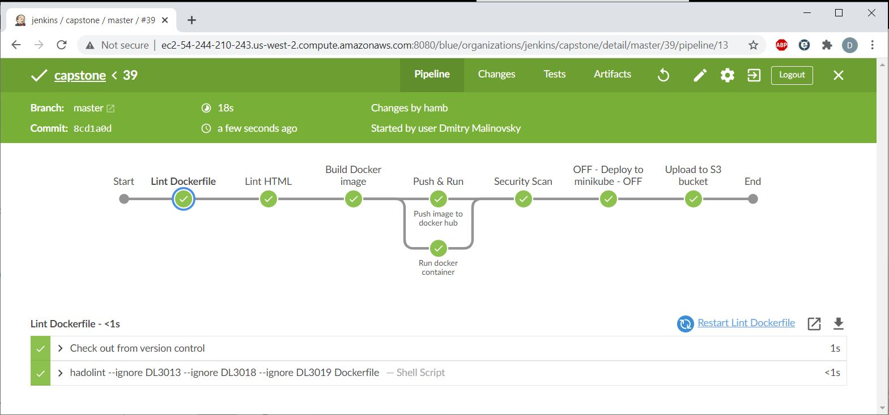

<b>It will have the following steps: </b> 
- Lint Dockerfile with hadolint <i> [failed Linting screenshot below] </i>
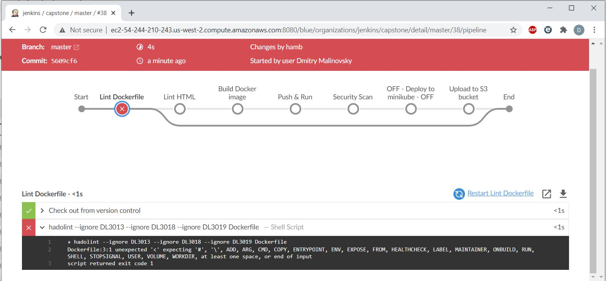
- Lint HTML with tidy <i> [failed Linting screenshot below] </i>
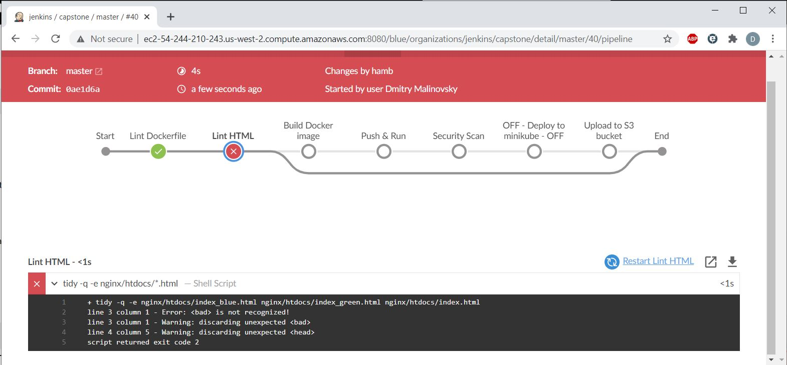
- Build Docker image with dummy web site running on nginx
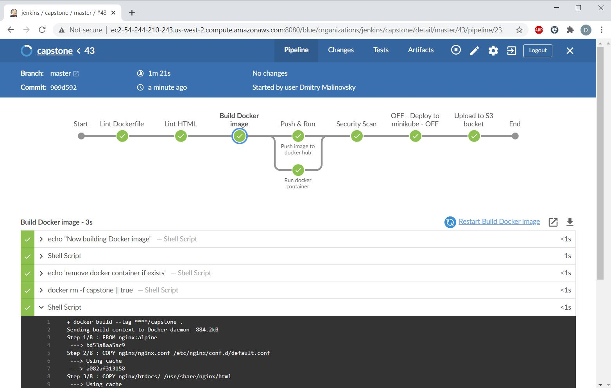
- Run docker container from builded image (https://dmalinov-capstone.s3.us-west-2.amazonaws.com/docker_ps_output.txt)
- Push image to the docker hub (https://hub.docker.com/repository/docker/hamb/capstone)
- Security Scan of builded image with AquaMicroscanner (https://dmalinov-capstone.s3.us-west-2.amazonaws.com/scanlatest.html)
- Upload artefacts to AWS S3 bucket (info about running docker container and image testing output)
- Successfull finish of the CI Pipeline will trigger corresponding CD pipeline that will deploy app image to EKS cluster

## EKS cluster deployment
<b> Deploy kubernetes cluster to AWS EKS with eksctl { https://docs.aws.amazon.com/eks/latest/userguide/getting-started-eksctl.html } </b> 
- make sure that AWS CLI is installed (it's pre-installed on AWS AMI)
- make sure AWS EKSCTL installed ('make aws-eksctl' if not yet)
- configure AWS CLI ('aws configure')
- appropriate policies should be attached to IAM:user - IAM, EKS, EC2, VPC, etc <i> [i did it manually via AWS IAM] </i>
- run eks_cluster_ceate.sh script <i> [i've excluded this step from pipeline - not to run it each time pipeline running, because it takes much time] </i>: 

 it will deploy the new stack "eksctl-capstone-cluster" to AWS EKS:
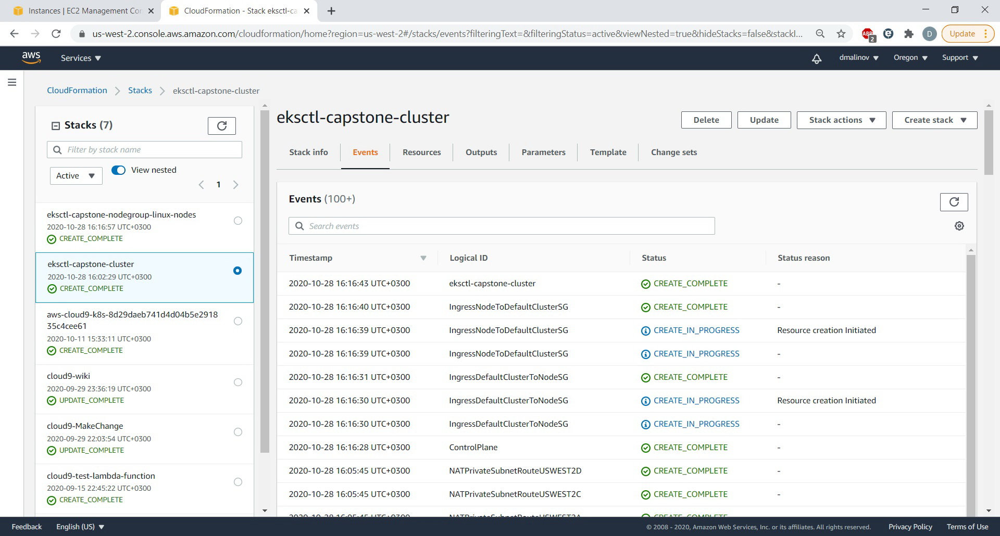 
 and nodegroup "eksctl-capstone-nodegroup-linux-nodes" according to settings in the script:
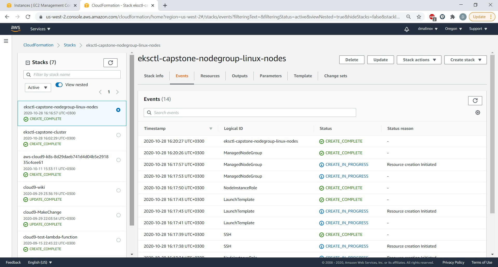 
 so we will see 3 new ec2 m5.large instances (capstone-linux-nodes-Node) running:
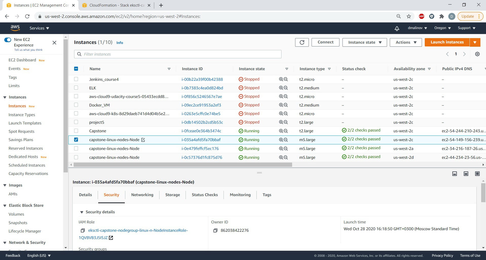

<b>After we've deployed EKS cluster we could deploy our nginx dummy app to the k8s cluster and check how Green-Blue updates are working. </b>

## CD Pipeline
- Any git push in one of Green/Blue branches automatically starts appropriate CI pipeline (described above) with linting, building docker container and pushing the image to Docker hub. 
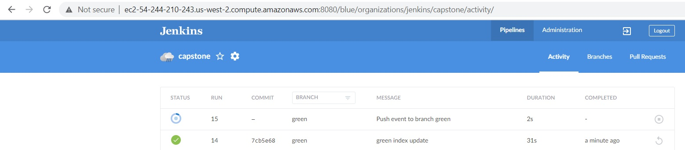

- After successfull finish of CI pipeline one of Green/Blue CD pipelines ('eks-deployment-(green/blue)') triggers accordingly:
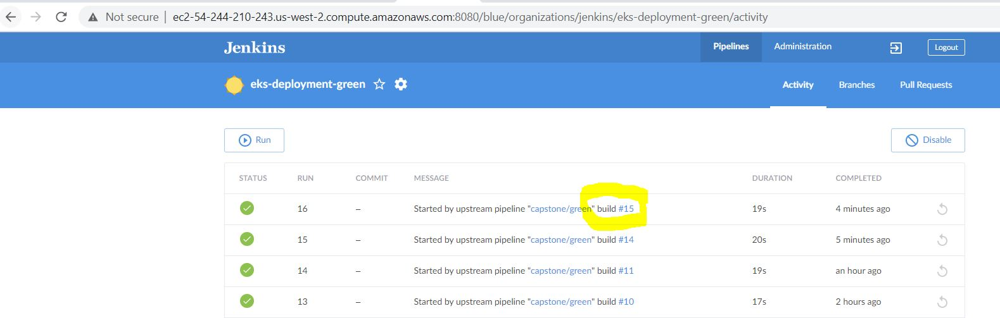

- This CD pipeline will deploy builded app container to EKS kubernetes cluster. 
- In the post-deployment output stage LoadBalancer's URLs could be found:
LoadBalancer Ingress:     a0252a5518b424485901b8f760e39a07-2139813722.us-west-2.elb.amazonaws.com
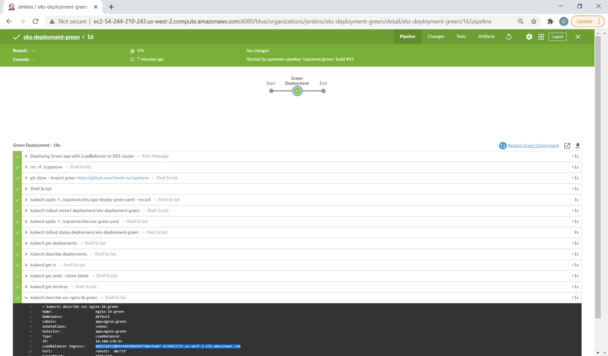

- And we can check our Green/Blue apps deployments in the browser:
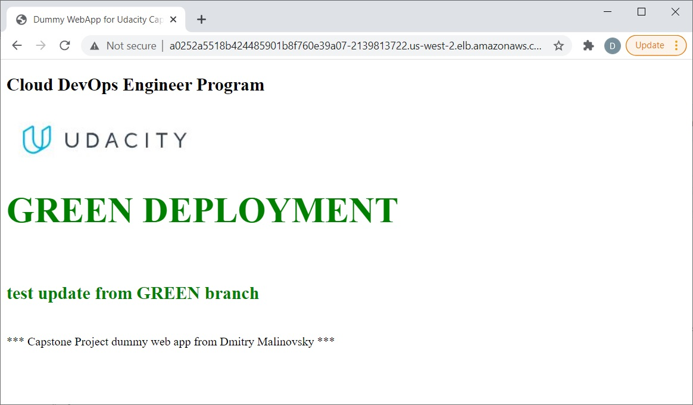
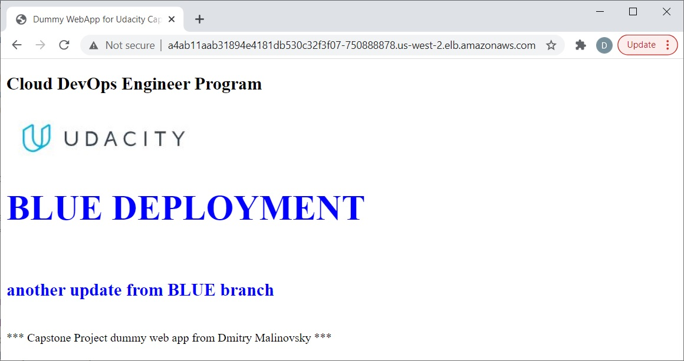

## So our CI/CD pipeline is ready!
 CI pipeline lints the code, build the image, push the image and then run the CD pipeline to deploy the image to the aws cluster. 
 Every time we have commit to the git repository, the continuous integration / continuous deployment pipeline is going to run automatically and that it's going to save time!
 

===========================================================================

